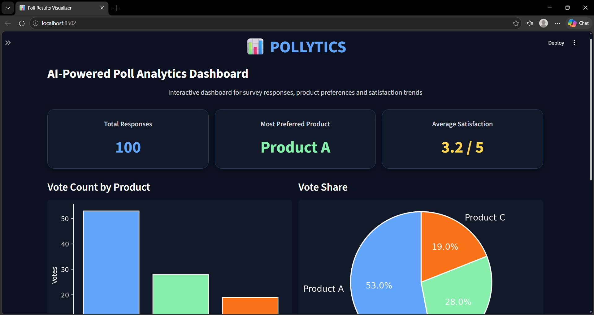
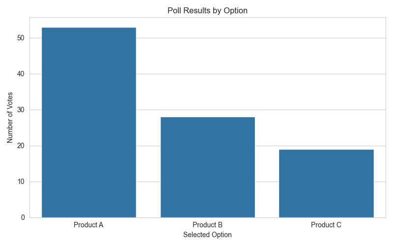
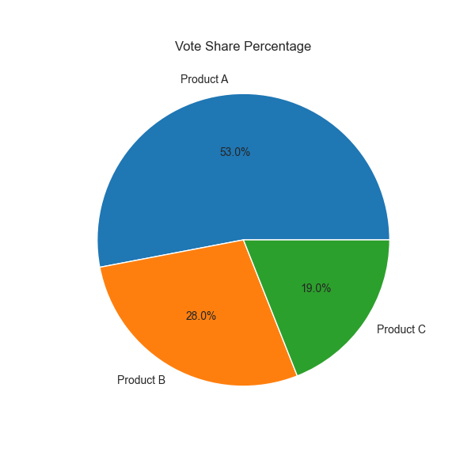
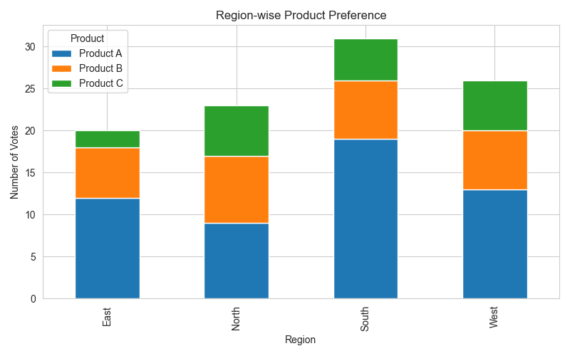
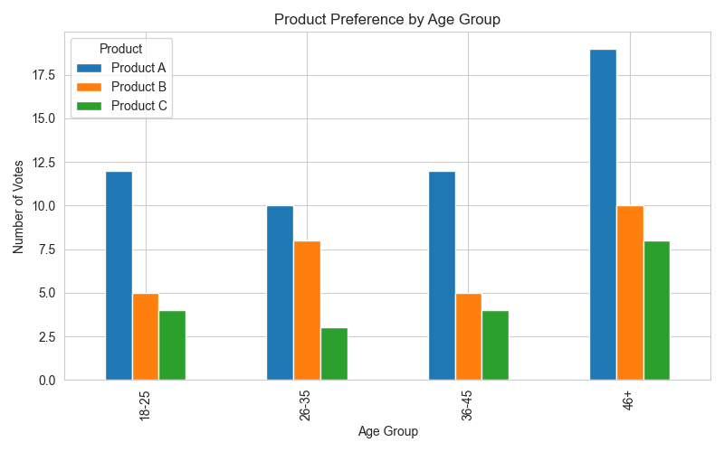
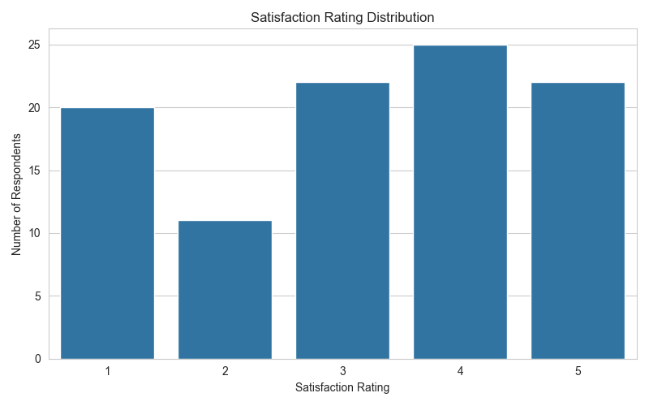

# 📊 POLLYTICS

An interactive data analysis and visualization project built using Python and Streamlit to analyze survey and poll responses. The project processes respondent data, generates insights, and displays them in a modern dark-themed dashboard.

## 🚀 Features

* Clean and preprocess poll response data
* Analyze product preference, region-wise responses, age group preferences, satisfaction distribution, and feedback trends
* Interactive Streamlit dashboard with region filter
* Modern dark UI with KPI cards and charts
* Automatically saves generated plots in the `outputs/` folder

## 🖥️ Dashboard Preview



## 📈 Visualizations

### Product Preference by Votes



### Vote Share Percentage



### Region-wise Product Preference



### Product Preference by Age Group



### Satisfaction Rating Distribution



## 📂 Project Structure

```
Poll-Results-Visualizer/
├── app.py
├── main.py
├── README.md
├── requirements.txt
├── .gitignore
├── data/
│   ├── poll_data.csv
│   └── cleaned_poll_data.csv
└── outputs/
    ├── dashboard1.png
    ├── dashboard2.png
    ├── bar_chart.png
    ├── pie_chart.png
    ├── region_chart.png
    ├── age_group_chart.png
    └── satisfaction_chart.png
```

## ⚙️ Technologies Used

* Python
* Pandas
* Matplotlib
* Streamlit
* WordCloud

## 📊 Key Insights

* Product A received the highest number of votes
* South region recorded the maximum responses
* Average satisfaction rating is approximately 3.2 / 5
* Common feedback words include “easy”, “useful”, and “good product”

## 🔮 Future Improvements

* Add filters for age group and gender
* Enable CSV export for filtered results
* Add interactive charts using Plotly
* Deploy the dashboard online with Streamlit Cloud
* Connect the project to live survey data

## 👩‍💻 Author

Shrestha Mukherjee
